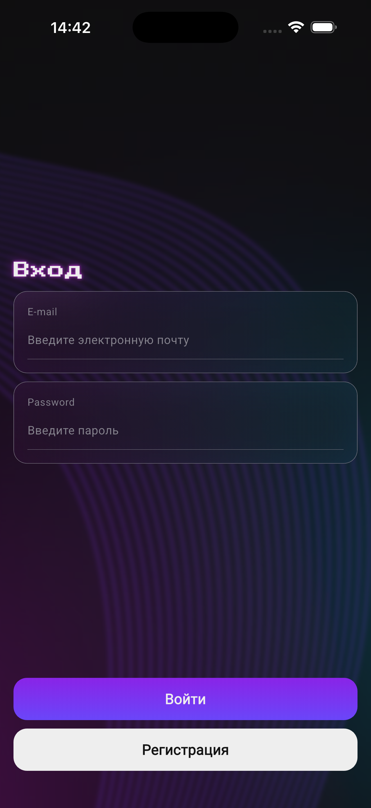
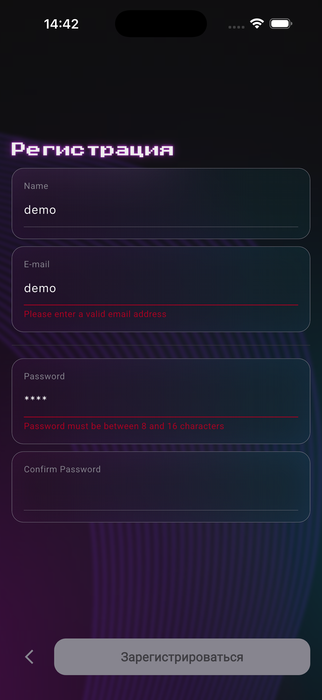
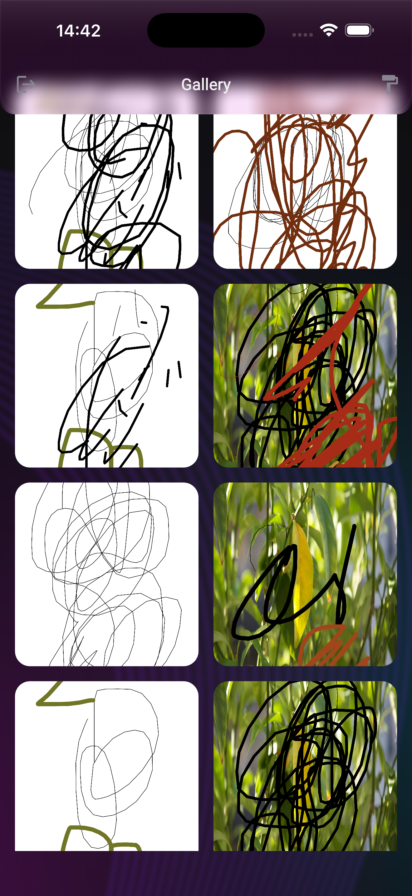
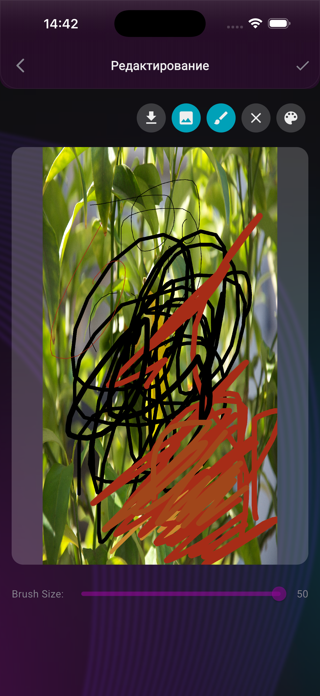
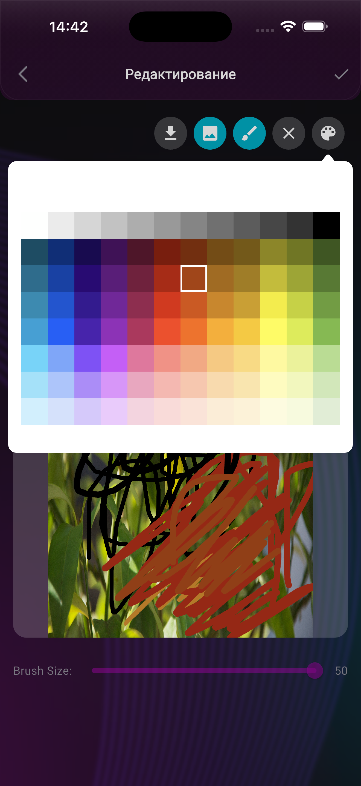
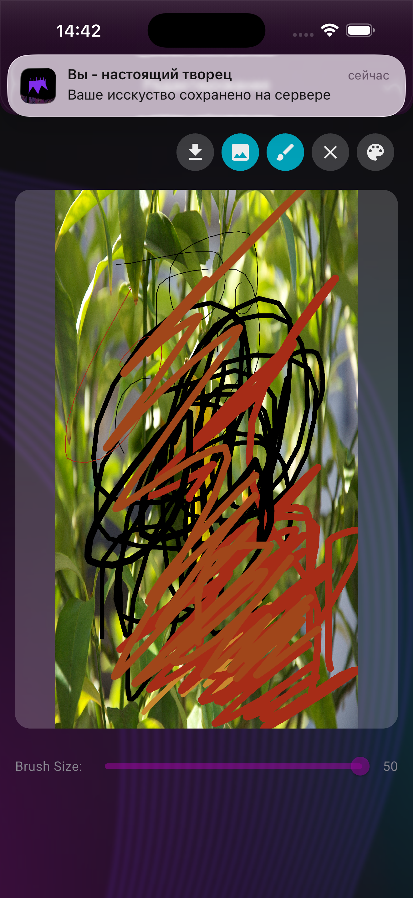
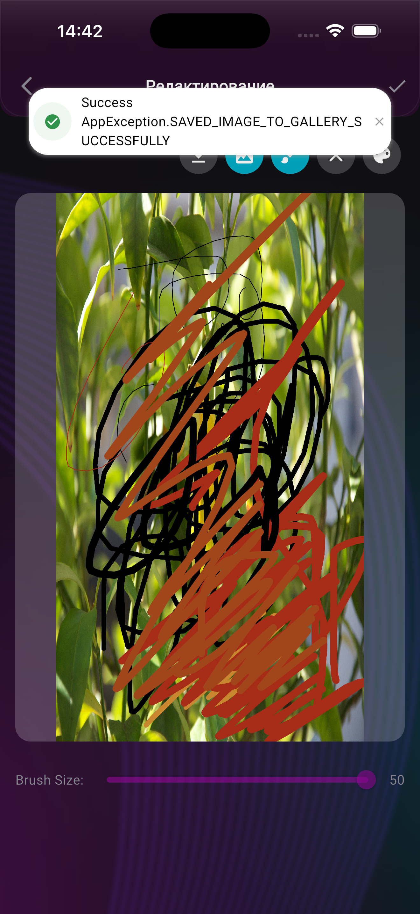
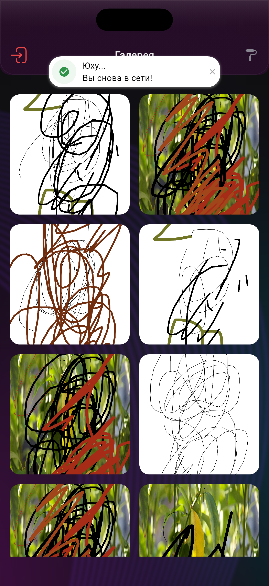
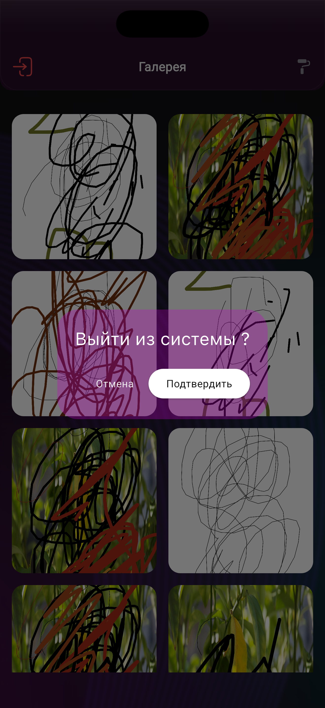

# 🎨 DYD - Draw Your Dream
 👇[Youtube Video Demo] https://youtu.be/wKfngTGEWKI

A modern Flutter application for creative drawing and sharing. Built with Firebase backend, local notifications, and cross-platform support.

## 🏙️ Screenshots
|Auth|Register|Gallery|Drawing|
|---|---|---|---|
|      |  |  |  | 
|Color Picker|Notification|Toastification|  Connectivity Checker|
|      |  |  |  | 
|Connection On|LogOut Confirm||  |
|      |  |  |  | 


## ✨ Features

- 🎭 **Drawing Tools** - Rich set of painting and drawing features
- 🔐 **Authentication** - Firebase authentication with email support
- ☁️ **Cloud Storage** - Firebase Firestore and Storage integration
- 🔔 **Notifications** - Local push notifications support (iOS/Android)
- 🌍 **Cross-Platform** - iOS, Android, Web, macOS, Windows, Linux support
- 🎯 **Navigation** - Smooth navigation with GoRouter
- 🎨 **Modern UI** - Beautiful UI with Google Fonts and SVG icons

## 📋 Prerequisites

- Flutter SDK: ^3.9.2
- Dart SDK: Latest stable
- Xcode 14+ (for iOS)
- Android SDK (for Android)
- Firebase project configured
- BloC + Clean Architecurre

## 🚀 Installation

1. **Clone the repository**

```bash
git clone https://github.com/jchocola/DYD_Draw_Your_Dream.git
cd dyd_drawer
```

2. **Install dependencies**

```bash
flutter pub get
```

3. **Configure Firebase**

- Add your `GoogleService-Info.plist` for iOS
- Add your `google-services.json` for Android
- Update Firebase options in the project

4. **Run the app**

```bash
flutter run
```

## 📦 Main Dependencies

- **firebase_core**: Firebase initialization
- **firebase_auth**: User authentication
- **flutter_bloc**: State management
- **go_router**: Navigation routing
- **flutter_local_notifications**: Push notifications
- **simple_painter**: Drawing functionality
- **google_fonts**: Custom typography

## 🏗️ Project Structure

```
lib/
├── core/              # Core utilities and constants
├── feature/           # Feature modules (notification, etc.)
├── shared/            # Shared components and widgets
└── main.dart          # Entry point
```

## 🔄 State Management

The app uses **BLoC pattern** with `flutter_bloc` for state management.

## 🌐 Platform Support

| Platform | Status       |
| -------- | ------------ |
| iOS      | ✅ Supported |


## 📱 iOS Setup

The app uses modern UISceneDelegate for iOS app lifecycle management.

**Requirements:**

- iOS 11.0+
- Update Info.plist with required permissions
- Local notifications configured in AppDelegate

## 🐛 Development

### Clean Build

```bash
flutter clean
rm -rf ios/Pods ios/Podfile.lock
flutter pub get
flutter run
```

### Run with Verbose Logging

```bash
flutter run -v
```


## 📄 License

This project is public for everyone ! Let's Contribute 🔥

## 👤 Author

jchocola - [GitHub Profile](https://github.com/jchocola)
